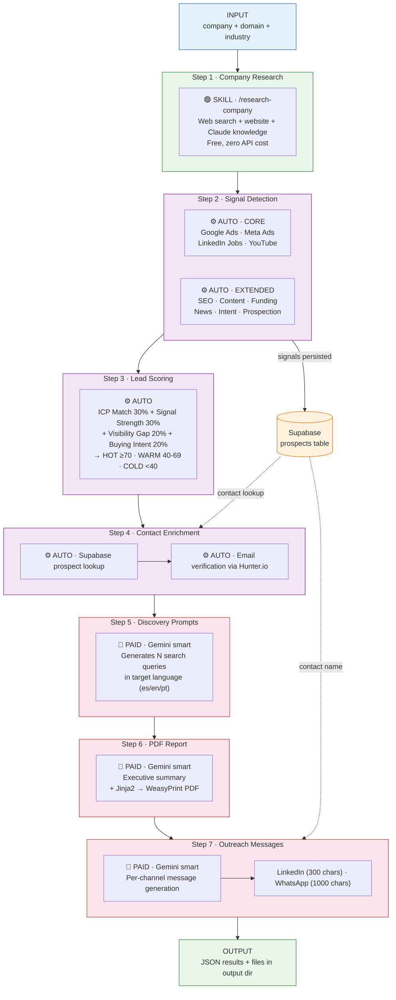

# B2B Outreach Toolkit

General-purpose modules for B2B outbound selling workflows: market signal detection, lead scoring, contact enrichment, campaign sequencing, and message formatting.

## Pipeline Flow



**Legend:** 🟢 Claude Code skill (free) · ⚙️ Automated APIs/config (no LLM) · 🔴 Paid LLM call (Gemini)

**Skip flags:** Each step can be skipped independently (`--skip-research`, `--basic-signals`, `--skip-enrichment`, `--skip-prompts`, `--skip-report`, `--skip-messages`). Steps 6 & 7 also require `visibility_metrics` from an external AEO pipeline.

**External services per step:**

| Step | Type | Engine | APIs / Tools |
|------|------|--------|--------------|
| 1. Research | 🟢 Skill | Claude Code (`/research-company`) | WebSearch, WebFetch — free |
| 2. Signals | ⚙️ Auto | — | DataForSEO, Meta, YouTube, Crunchbase, Google News, G2 |
| 3. Scoring | ⚙️ Auto | — | Config-driven (`scoring.yaml`) |
| 4. Enrichment | ⚙️ Auto | — | Supabase, Hunter.io |
| 5. Prompts | 🔴 Paid | Gemini (`smart`) | — |
| 6. Report | 🔴 Paid | Gemini (`smart`) | WeasyPrint (local) |
| 7. Messages | 🔴 Paid | Gemini (`smart`) | Supabase |

## Architecture

```
products/b2b_outreach/
├── models.py                  # Core dataclasses (CompanyResearch, signals, OutreachPackage)
├── config/
│   ├── b2b_outreach.yaml      # General config (signals, outreach, supabase)
│   └── scoring.yaml           # Lead scoring weights and ICP industries
├── signals/
│   └── detector.py            # Market signal detection (10+ external APIs)
├── scoring/
│   ├── models.py              # ScoreTier, ScoringWeights, LeadScore
│   └── lead_scorer.py         # Lead scoring algorithm (ICP, signals, visibility, intent)
├── enrichment/
│   ├── models.py              # ContactRole, EnrichedContact, EmailVerificationStatus
│   ├── contact_finder.py      # Hunter.io, Apollo.io, RocketReach
│   └── email_verifier.py      # Email verification via Hunter.io
├── campaigns/
│   ├── models.py              # Campaign, Touch, EngagementEvent
│   ├── sequencer.py           # Multi-touch campaign scheduling
│   └── tracker.py             # UTM builder, engagement scoring (pure functions)
├── outreach/
│   ├── linkedin_formatter.py  # LinkedIn InMail formatting (300 chars, no emojis)
│   ├── whatsapp_formatter.py  # WhatsApp formatting (1000 chars, emojis OK)
│   └── supabase_client.py     # Supabase contact CRUD
├── prompts/
│   └── templates.py           # Discovery prompt template for LLM query generation
├── templates/
│   ├── pdf_template.html      # PDF report Jinja2 template
│   └── styles.css             # PDF styling
└── claude/
    └── run_pipeline.py        # Standalone signal + scoring + enrichment pipeline
```

## Modules

### signals/detector.py
Detects 9 signal types from external APIs:
- **Google Ads** (DataForSEO API) — ad campaign activity
- **Meta Ads** (Ad Library API) — Facebook/Instagram ads
- **LinkedIn Jobs** (web scraping) — hiring velocity
- **YouTube** (Data API) — brand mentions
- **SEO Performance** (DataForSEO Labs) — organic traffic, keywords, domain rank
- **Content Activity** (DataForSEO SERP) — blog activity, featured snippets
- **Prospection Analysis** — composite signal from all above
- **Funding** (Crunchbase API) — recent funding rounds
- **News** (Google News RSS) — product launches, partnerships
- **Intent** (G2 reviews) — buyer intent signals

### scoring/lead_scorer.py
Weighted scoring across 4 dimensions:
- **ICP Match** (30%) — industry fit, audience, hiring velocity
- **Signal Strength** (30%) — ads, growth, social, SEO, content, funding, news
- **Visibility Gap** (20%) — lower AI mention rate = higher opportunity
- **Buying Intent** (20%) — funding, executive hires, product launches

Tiers: Hot (>=70), Warm (40-69), Cold (<40). Config-driven via `scoring.yaml`.

### enrichment/
Contact discovery across 3 providers (Hunter.io, Apollo.io, RocketReach) with email verification. Cascading search: tries Hunter first, fills gaps with Apollo, falls back to RocketReach for critical roles.

### campaigns/
Campaign models and sequencer for multi-touch outreach:
1. LinkedIn connection (day 0)
2. LinkedIn message (day 3, if connected)
3. Email with report (day 5)
4. WhatsApp follow-up (day 7, if email opened)
5. Phone call (day 10, if lead_score >= 70)

Storage callbacks are injectable via `on_campaign_created` parameter.

### outreach/
Channel-specific message formatters (LinkedIn: professional, no emojis, 300 chars; WhatsApp: conversational, emojis OK, 1000 chars) and Supabase contact client.

## Required Environment Variables

| Variable | Service | Required |
|---|---|---|
| `DATAFORSEO_LOGIN` | DataForSEO (ads, SEO, content) | For signal detection |
| `DATAFORSEO_PASSWORD` | DataForSEO | For signal detection |
| `META_ACCESS_TOKEN` | Meta Ad Library | For Meta ads detection |
| `YOUTUBE_API_KEY` | YouTube Data API | For YouTube mentions |
| `CRUNCHBASE_API_KEY` | Crunchbase | For funding signals |
| `HUNTER_API_KEY` | Hunter.io | For contact enrichment + email verification |
| `APOLLO_API_KEY` | Apollo.io | For contact enrichment |
| `ROCKETREACH_API_KEY` | RocketReach | For contact enrichment |
| `SUPABASE_URL` | Supabase | For contact storage |
| `SUPABASE_KEY` | Supabase | For contact storage |

## Usage

### Claude Code Script (standalone)
```bash
uv run python products/b2b_outreach/claude/run_pipeline.py \
    --company "Stripe" \
    --domain "stripe.com" \
    --industry "Financial Infrastructure" \
    --output results.json
```

### CLI via main.py
```bash
uv run python main.py b2b-outreach \
    --company "Stripe" \
    --domain "stripe.com"
```

### As a Library
```python
from products.b2b_outreach.signals import detector
from products.b2b_outreach.scoring import lead_scorer
from products.b2b_outreach import models

signals = detector.detect_all_signals("Stripe", "stripe.com")

research = models.CompanyResearch(
    name="Stripe", domain="stripe.com", industry="Fintech",
    products=["Payments"], services=["Payment Processing"],
    value_proposition="Financial infrastructure for the internet",
    target_audience="Developers and businesses", pain_points=[]
)

score = lead_scorer.score_lead(research, signals, visibility_metrics={})
```

## Integration with bison-aeo

This package provides the general-purpose modules consumed by `bison-aeo/offer/` for AEO-specific workflows (visibility analysis via LLMs, Gemini-based company research, Firestore storage, PDF report generation). bison-aeo retains only the functions that depend on its infrastructure (`aeo.llms.*`, `aeo.monitoring.*`, `aeo.db.*`).
